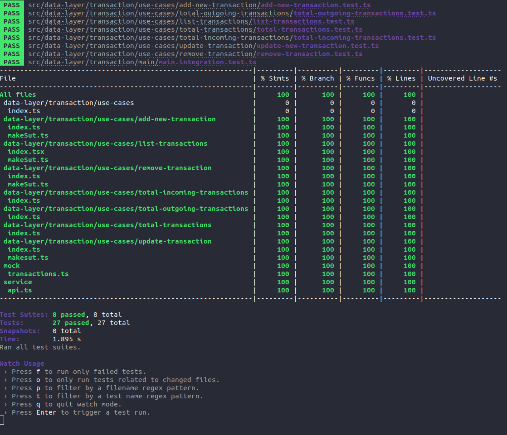

# Dtmoney-micro-frontend

Project aims to study DDD, domain driven design for the front end.
Project is on a micro-frontend architecture with "Single-SPA" in React.

#Javascript #React #Single-SPA #Micro-frontend #DDD #SOLID #System-Under-Test

## Domain

- Transactions

## Sub domains

### add new transaction

- Name transaction
- amount
- type: Deposit / Withdrawal
- Category

### remove transaction

- id transaction

### update transaction

- id transaction
- Name transaction
- amount
- type: Deposit / Withdrawal
- Category

### list transactions

- id transaction
- Name transaction
- amount
- type: Deposit / Withdrawal
- Category
- Date transaction

### total incoming transactions

- number (total)

### total outgoing transactions

- number (total)

### total transactions

- number (total)
